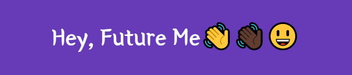

<br />


<b><center>Dear me, I am writing this to remind you of the most important things. Essential plans: Jump from an airplane in dubai, Run around naked at a public event, kiss a prince…”</center></b>
<br />
<b><i>Think about how the feeling you'll get when you read this letter back to your future self. It could be a reminder of who you were versus who your are becoming.</i></b>
<br />

## <b> Installation </b>
1. Clone repository - git clone https://github.com/TijanAyo/HeyFutureMe.git


2. Install dependencies -  ```npm install```

3. Create a new file ```.env``` if it doesn't exist and copy the contents of ```.env.example``` into it to be able to run your server on production environment.

<br />

## <b> Running on Local Server </b>
1. Start up the server - Run ```npm start``` |``` npm run dev```

2. Server should be running on http://localhost:4000/ by default